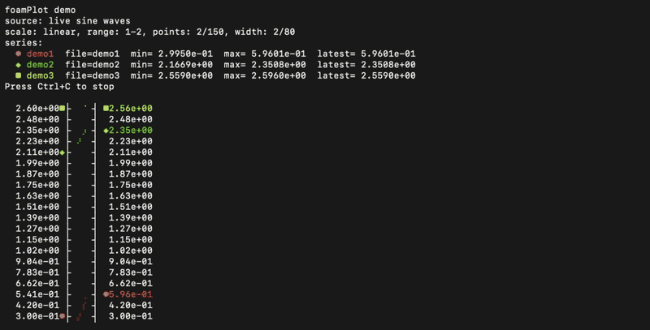

# foamplot

[](https://pypi.org/project/foamplot/)
[](https://pypi.org/project/foamplot/)
[](https://github.com/lsongrui/foamplot/blob/main/LICENSE)

Plot OpenFOAM-style residual/log files in the terminal.

`foamplot` reads numeric values from one or more files and draws a live terminal plot using Unicode/Braille characters. It is useful for watching residuals, objective values, forces, coefficients, or any scalar log that grows line by line.

Built on top of [`plotille`](https://pypi.org/project/plotille/).

```bash
pip install foamplot
```

or, as an isolated CLI app:

```bash
pipx install foamplot
```

## Demo

```bash
foamplot --demo -i 0.1 -W 80
```



## Examples

Plot one file:

```bash
foamplot residuals.log
```

Follow a file live:

```bash
foamplot residuals.log --follow
```

Plot several files:

```bash
foamplot p.log Ux.log Uy.log Uz.log
```

Name the series:

```bash
foamplot p.log Ux.log Uy.log Uz.log --names p,Ux,Uy,Uz
```

Use a linear scale:

```bash
foamplot residuals.log --scale linear
```

Use a wider and taller plot:

```bash
foamplot residuals.log --plot-width 160 --height 30
```

Select a numeric token from each line:

```bash
foamplot residuals.log --column 1
```

## What it reads

`foamplot` extracts numbers from each input line.

For a line like:

```text
Solving for Ux, Initial residual = 1.23e-04, Final residual = 8.90e-06, No Iterations 2
```

the numeric tokens are:

```text
0: 1.23e-04
1: 8.90e-06
2: 2
```

By default, `foamplot` uses the last token. To plot the final residual above:

```bash
foamplot Ux.log --column 1
```

## Live mode

```bash
foamplot residuals.log --follow
```

In follow mode, the plot refreshes in place. Press `Ctrl+C` to stop.

## Multiple series

Each file becomes one line in the plot.

```bash
foamplot p.log Ux.log Uy.log --names p,Ux,Uy --follow
```

`foamplot` currently supports up to five series.

Markers:

```text
● ◆ ■ ▲ ✦
```

Colors:

```text
red, green, yellow, blue, magenta
```

## Log scale

The default scale is logarithmic:

```bash
foamplot residuals.log --scale log
```

In log scale, only positive values are plotted.

For zero or negative values, use:

```bash
foamplot residuals.log --scale linear
```

## Options

```text
usage: foamplot [-h] [-p POINTS] [-W PLOT_WIDTH] [-H HEIGHT]
                [-i INTERVAL] [-c COLUMN] [--names NAMES]
                [-f] [--demo] [--demo-points DEMO_POINTS]
                [--demo-lines DEMO_LINES] [--phase-step PHASE_STEP]
                [--scale {log,linear}]
                [files ...]
```

| Option             | Description                                            |
| ------------------ | ------------------------------------------------------ |
| `files`            | Input files. Each file becomes one series.             |
| `-p, --points`     | Number of latest lines to read. Default: `1000`.       |
| `-W, --plot-width` | Plot width in terminal columns. Default: `120`.        |
| `-H, --height`     | Plot height. Default: `20`.                            |
| `-i, --interval`   | Refresh interval in seconds. Default: `0.5`.           |
| `-c, --column`     | Zero-based numeric token to use. Default: last number. |
| `--names`          | Comma-separated series names.                          |
| `-f, --follow`     | Keep refreshing the plot.                              |
| `--demo`           | Run the built-in sine-wave demo.                       |
| `--demo-points`    | Number of demo points. Default: `100`.                 |
| `--demo-lines`     | Number of demo series, 1 to 5. Default: `1`.           |
| `--phase-step`     | Phase increment in demo mode. Default: `0.25`.         |
| `--scale`          | `log` or `linear`. Default: `log`.                     |

## TestPyPI

During testing:

```bash
python3 -m pip install --user --upgrade \
  -i https://test.pypi.org/simple/ \
  --extra-index-url https://pypi.org/simple/ \
  foamplot
```

## Notes

- Requires Python 3.6+.
- Intended for Linux/macOS terminals.
- Uses `tail -n` internally.
- Requires a Unicode-capable terminal.

## License

MIT
